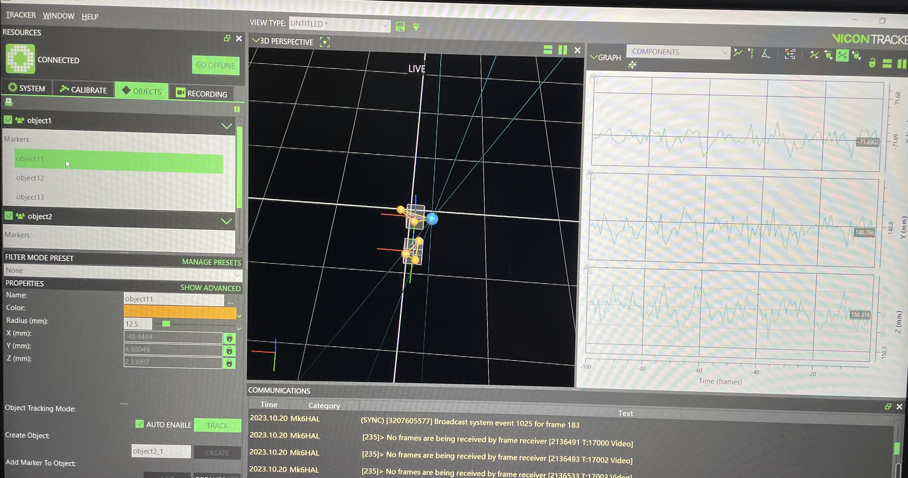
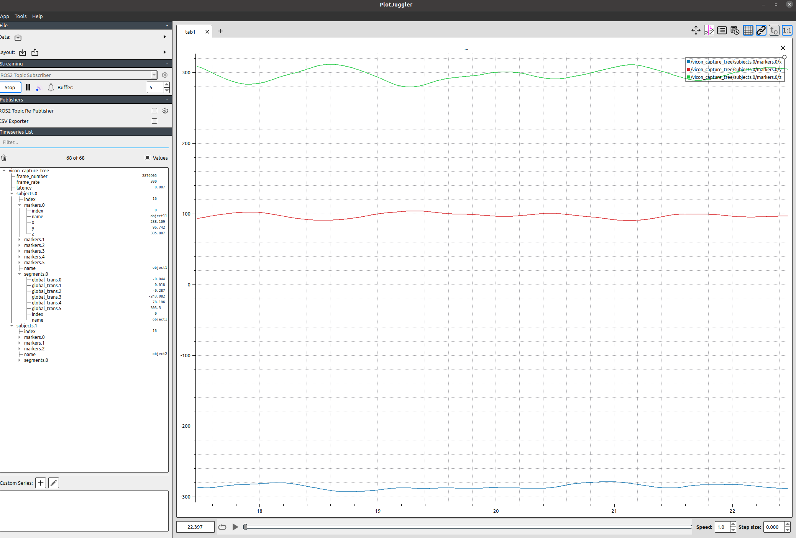

# Vicon_ROS2_Bridge

## 1. Overview
Here are the ROS2 package to publish vicon server's track data(subject, segment and marker) realtime on Ubuntu. Node `vicon_ros2_bridge` depends on ViconDataStreamSDK_Linux64 (https://www.vicon.com/software/datastream-sdk/).

## 2. Packages
**vicon_msgs**: `Marker.msg`, `Segment.msg`,`Subject.msg`,`ViconCaptureTree.msg`

**Vicon_ros2_bridge**: topic name is `"vicon_capture_tree"`

## 3. How to run 
First, configure the computer IP to `192.168.10.X` network segment.

run
* `colcon build`
* `. install/setup.bash`
* `ros2 run vicon_ros2_bridge vicon_ros2_brige` in dir **Vicon_ROS2_Bridge**

If return *"Vicon Server connect successfully!"* and show information of capture tree, means node open normal.

## 4. Dependencies
* ROS2 foxy on Ubuntu20.04
* vicon_msgs

## 5. Detials
```
hugh@destop:~/Vicon_ROS2_Bridge$ ros2 run vicon_ros2_bridge vicon_ros2_brige

Vicon Server connect successfully!
Segment lightweight data enable successfully!
********************Subjects and Markers information*********************
_______subject_______
the number of Subject is 2
NO: 0 Subject name is :object1
    _______segment_______
    the number of object1 Segment is :1
    NO: 0 Segment name is :object1
    _______marker_______
    the number of object1 marker is :3
    NO: 0 marker name is :object11
    NO: 1 marker name is :object12
    NO: 2 marker name is :object13

NO: 1 Subject name is :object2
    _______segment_______
    the number of object2 Segment is :1
    NO: 0 Segment name is :object2
    _______marker_______
    the number of object2 marker is :3
    NO: 0 marker name is :object21
    NO: 1 marker name is :object22
    NO: 2 marker name is :object23

***********************************************************************
```

**vicon traker software**


**plotjugger**


  


